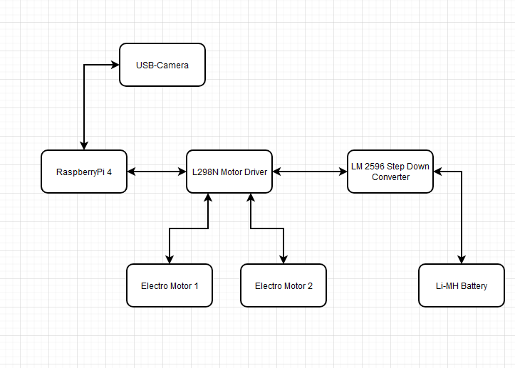

# Webapp gesteuertes Auto

## Aufgabenstellung

Im Rahmen dieses Projekts möchten wir ein Auto mit Hilfe eines Raspberry Pi bauen, das über eine WebApp gesteuert werden kann. Die WebApp soll direkt auf dem Raspberry Pi gehostet werden und es ermöglichen, das Auto zu steuern. Auf dem Auto wird außerdem eine Kamera angebracht, deren Bild auf die WebApp übertragen wird. 

Das Auto soll in der Lage sein, geradeaus zu fahren. Zusätzlich soll die WebApp die aktuelle Geschwindigkeit des Autos in km/h anzeigen und einen Kilometerzähler implementieren, der die zurückgelegte Distanz erfasst und ebenfalls auf der WebApp dargestellt wird.

## Bewertung

#### GKü

- [x] Das Auto kann fahren
- [x] Steuerung über Web App

#### GKv

- [x] Bildübertragung

#### EKü

- [x] Das Auto kann gerade fahren
- [x] Batterie austauschen

#### EKv

- [x] Web App kann Geschwindigkeit ausgeben

## Arbeitsschritte

### Flashen des Raspberry Pis

Wir haben das `Raspberry Pi OS lite (64-bit)` im Raspberry Pi Imager ausgewählt und etwaige andere Konfigurationen getätigt (z.b.: Einrichten vom WLAN für TGM_IOT) und das ganze auf den Raspberry Pi geflashed.

### Verbinden mit Computer

Danach haben wir versucht uns mit den Raspberry Pi zu verbinden.

```bash
# Konfigurierter Hostname kann zum Verbinden verwendet werden
ssh autopi.local -l pi -p 22
```

### Problem

Zuerst hatten wir den Raspberry Pi 1 Model A und sind später nach mehrfach fehlgeschlagenen Verbindungsversuchen erst drauf gekommen, dass diese Version kein WLAN Modul integriert hat.
Der zweite Raspberry Pi war ein 3 B Modell, welches grundsätzlich nicht funktioniert hat. Als letzte Option blieb uns nur mehr einen funktionierenden Raspberry Pi  vom Herrn Professor Borko auszuborgen. Nach dem wir das überlebten hat zum Glück alles einwandfrei funktioniert. In der nächsten Stunde wollte uns der Herr Professor Borko keinen Raspberry Pi mehr geben und wir mussten unseren eigenen Raspberry Pi (4 B) verwenden. Leider hat uns dieses Projekt nicht am Raspberry Pi 2 vorbei geführt 😔 sonst hätten wir alle bis zur Reihe 4 durchgetestet.

### Verkabelung des Raspberry Pi's

Dafür haben wir den Raspberry Pi mit dem L298N verbinden. 

Unser Pin-Anordnung war:

- **ENA GIPO 17**: aktivieren des rechten Motors
- **IN1 GPIO 27**: rechts nach hinten
- **IN2 GIPO 22**: rechts nach vorne
- **IN3 GPIO 5**:  linkes nach hinten
- **IN4 GPIO 6**:  linkes nach vorne
- **ENB GPIO 26**: aktivieren des linken Motors

## Unabhängige Stromversorgung

Da die eingebaute Stromversorgung 6V (4x 1.5V Batterien) lieferte mussten wir das Setup umbauen um genau 5V für den Raspberry Pi zu liefern.
Da wir keine Powerbank hatten mussten wir uns unser Stromversorgung selber bauen. Wir haben uns einen V12-Akku genommen und den Strom dann mit einem Step down Spannungsregler (HW316e) auf 5V gebracht.

## Code
### Kamera Übertragung

Die USB Kamera wurde angeschlossen und in der flask web app eingebettet. Dabei wurde die Open-CV library verwendet um Bilder zu rendern.

`flasp.py`
```python
from flask import Flask, Response, render_template, request
from picamera2 import Picamera2
import cv2
import RPi.GPIO as GPIO


# Version 1.2

app = Flask(__name__)

# camera = cv2.VideoCapture('/dev/media4', cv2.CAP_V4L2)  # Assuming your USB camera is at index 0
camera = cv2.VideoCapture(0)

# Check if the camera opened correctly
if not camera.isOpened():
    # raise RuntimeError("Could not start camera.")
    print("Could not start camera.")
camera.set(cv2.CAP_PROP_FPS, 30)

def generate_frames():
    while True:
        ret, frame = camera.read()  # Capture frame from the USB camera
        if not ret:
            break
        ret, buffer = cv2.imencode('.jpg', frame)
        frame = buffer.tobytes()
        yield (b'--frame\r\n'
               b'Content-Type: image/jpeg\r\n\r\n' + frame + b'\r\n')

@app.route('/video_feed')
def video_feed():
    return Response(generate_frames(), mimetype='multipart/x-mixed-replace; boundary=frame')
```

### Steuerung der Motoren

Die Motoren wurden mit der Library RPi.GPIO gesteuert. 

`flask.py`
```python
GPIO.setmode(GPIO.BCM)
motor_pins = {"right_forward": 27, "right_backward": 22, "left_forward": 5, "left_backward": 6, "ENA": 17, "ENB": 26}

for pin in motor_pins.values():
    GPIO.setup(pin, GPIO.OUT)
    GPIO.output(pin, False)

# Control functions
def move_car(action):
    if action == "backward":
        GPIO.output(motor_pins["ENA"], True)
        GPIO.output(motor_pins["ENB"], True)
        GPIO.output(motor_pins["left_backward"], True)
        GPIO.output(motor_pins["right_backward"], True)

    elif action == "forward":
        GPIO.output(motor_pins["ENA"], True)
        GPIO.output(motor_pins["ENB"], True)
        GPIO.output(motor_pins["left_forward"], True)
        GPIO.output(motor_pins["right_forward"], True)
    elif action == "right":
        GPIO.output(motor_pins["ENA"], True)
        GPIO.output(motor_pins["ENB"], True)
        GPIO.output(motor_pins["right_backward"], True)
        GPIO.output(motor_pins["left_forward"], True)
    elif action == "left":
        GPIO.output(motor_pins["ENA"], True)
        GPIO.output(motor_pins["ENB"], True)
        GPIO.output(motor_pins["right_forward"], True)
        GPIO.output(motor_pins["left_backward"], True)
    elif action == "stop":
        stop_car()

def stop_car():
    for pin in motor_pins.values():
        GPIO.output(pin, False)

@app.route('/')
def index():
    return render_template('index.html')

@app.route('/control', methods=['POST'])
def control():
    action = request.form['action']
    move_car(action)
    return 'OK'

if __name__ == "__main__":
    try:
        app.run(host='0.0.0.0', port=5000, debug=True)
    except KeyboardInterrupt:
        GPIO.cleanup()
```

## Blockschaltdiagramm



## Learnings/ Erkenntnisse aus dem Projekt

In unserem Projekt haben wir viele Fähigkeiten wieder neu aufgefrischt. Wir haben Drähte gelötet, Datenblätter gelesen, einfache Schaltkreise gebaut und Kabel abgemantelt sowie mit Aderendhülsen versehen. 

Im Gegensatz dazu waren die Themen, die wir neu kennengelernt haben, das Rendern von Bildern mit OpenCV und deren Einbettung in eine Webseite. Außerdem haben wir mit dem LM2596 gearbeitet, um von einem Akku mit 12V auf 5V zukommen, die wir für das Betreiben des Raspberry Pi brauchen. Zusätzlich war es das erste Mal, dass wir wirklich mit einem Raspberry Pi gearbeitet haben, deswegen haben wir uns bei der Einrichtung von diesem auch am Aufgangs so schwergetan.
## Quellen:

+ "L298N" [L298N Motor Driver Module Pinout, Datasheet, Features &amp; Specs](https://components101.com/modules/l293n-motor-driver-module)  [10.10.2024]
+ "LM2596" [https://www.ti.com/product/LM2596](https://www.ti.com/product/LM2596 "https://www.ti.com/product/LM2596") [17.10.2024]
+ "OpenCV" [https://opencv.org/](https://opencv.org/ "https://opencv.org/") [17.10.2024]
+ "Life-Stream-App" [https://medium.com/@supersjgk/building-a-live-streaming-app-using-flask-opencv-and-webrtc-8cc8b521fa44](https://medium.com/@supersjgk/building-a-live-streaming-app-using-flask-opencv-and-webrtc-8cc8b521fa44 "https://medium.com/@supersjgk/building-a-live-streaming-app-using-flask-opencv-and-webrtc-8cc8b521fa44") [17.10.2024]
+ "Flask Webservice mit OpenCV" [https://stackoverflow.com/questions/62471577/python-flask-webservice-with-opencv-and-webcam](https://stackoverflow.com/questions/62471577/python-flask-webservice-with-opencv-and-webcam "https://stackoverflow.com/questions/62471577/python-flask-webservice-with-opencv-and-webcam") [17.10.2024]
+ "Raspberry Pi Video Stream" [https://www.hackster.io/Shilleh/how-to-stream-video-from-raspberry-pi-to-local-usb-camera-f9a8bb](https://www.hackster.io/Shilleh/how-to-stream-video-from-raspberry-pi-to-local-usb-camera-f9a8bb "https://www.hackster.io/Shilleh/how-to-stream-video-from-raspberry-pi-to-local-usb-camera-f9a8bb") [23.10.2024]
+ "Raspberry Pi Doku 4" [https://datasheets.raspberrypi.com/rpi4/raspberry-pi-4-datasheet.pdf](https://datasheets.raspberrypi.com/rpi4/raspberry-pi-4-datasheet.pdf "https://datasheets.raspberrypi.com/rpi4/raspberry-pi-4-datasheet.pdf") [17.10.2024]
+ "Raspberry Pi Doku 3" [https://datasheets.raspberrypi.com/rpi3/raspberry-pi-3-b-plus-product-brief.pdf](https://datasheets.raspberrypi.com/rpi3/raspberry-pi-3-b-plus-product-brief.pdf "https://datasheets.raspberrypi.com/rpi3/raspberry-pi-3-b-plus-product-brief.pdf") [17.10.2024]
-  "Raspberry Pi Pinout" [https://pinout.xyz/](https://pinout.xyz/ "https://pinout.xyz/") [17.10.2024]
